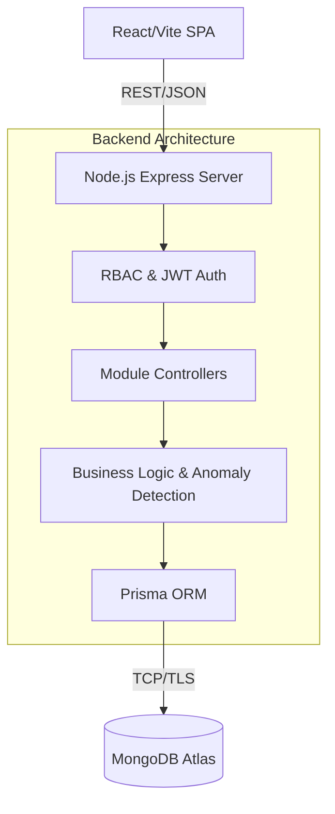

  <h1>🚛 TransitOps Enterprise</h1>
  <p><strong>Next-Generation Fleet, Dispatch, and Logistics Intelligence Platform</strong></p>
  
---

## 📖 Table of Contents
1. [Platform Overview](#-platform-overview)
2. [Core Modules](#-core-modules)
3. [System Architecture](#-system-architecture)
4. [Database Schema](#-database-schema)
5. [Security & RBAC](#-security--rbac)
6. [API Reference](#-api-reference)
7. [Local Deployment](#-local-deployment)
8. [Project Structure](#-project-structure)

---

## 🚀 Platform Overview

**TransitOps** is an enterprise-grade, end-to-end logistics management solution engineered to solve the complex operational challenges of modern fleet fleets. It bridges the gap between hardware tracking, human resource management, and financial analytics.

Built with a relentless focus on performance and user experience, TransitOps features a bespoke, premium **Glassmorphic Design System**, ensuring that dispatchers, fleet managers, and safety officers can process dense, real-time data rapidly and intuitively without visual fatigue.

---

## 🏗 Core Modules

### 1. Advanced Fleet Intelligence
- **Real-Time Lifecycle Tracking**: Monitor vehicle statuses (`AVAILABLE`, `ON_TRIP`, `IN_SHOP`, `RETIRED`) in real-time.
- **Depot & Region Mapping**: Geographically segment assets to ensure optimal dispatch routing.
- **Odometer & Depreciation Analytics**: Automatically ingest mileage data and track acquisition costs against generated revenue.

### 2. Intelligent Dispatch & Routing
- **Driver State Management**: Enforce strict licensing validity checks and fatigue limits before assignment.
- **Automated Workflows**: State machine-driven trip management (`DRAFT` → `DISPATCHED` → `COMPLETED` → `CANCELLED`).
- **Revenue Modeling**: Log cargo weight, estimated vs. actual distance, and compute net trip profitability instantly.

### 3. Fuel Anomaly & Fraud Detection
- **Algorithmic Baselines**: The system dynamically calculates implied fuel efficiency (km/L) across historical trips.
- **Automated Flagging**: Refuel logs that deviate from the standard vehicle baseline by a configurable threshold (e.g., >25%) are instantly flagged.
- **Investigation Workflows**: Safety officers are alerted to anomalies to investigate potential fuel theft, mechanical degradation, or harsh terrain routing.

---

## 📐 System Architecture

TransitOps is built on a decoupled, scalable API-driven architecture.



### Tech Stack Breakdown
* **Frontend**: React 18, Vite, TailwindCSS (Custom Design Tokens), Lucide Icons.
* **Backend**: Node.js, Express, TypeScript.
* **Data Layer**: Prisma ORM, MongoDB (NoSQL Document Store with strict relational enforcement via Prisma).

---

## 🗄 Database Schema

The TransitOps database is rigorously modeled to enforce referential integrity despite running on a NoSQL backbone. 

### Key Entities
* **`User`**: System access credentials mapped to an RBAC enum.
* **`Vehicle`**: Core physical asset. Tracks metrics, relations to trips, and maintenance.
* **`Driver`**: Human capital. Enforces safety scores and license expiration.
* **`Trip`**: The transactional hub tying together a `Vehicle`, a `Driver`, and revenue.
* **`FuelLog`**: Telemetry and financial data regarding asset refueling.

---

## 🛡 Security & RBAC

TransitOps utilizes a strict **Role-Based Access Control** architecture. JWT tokens are signed using a robust HS256 algorithm and validate user scopes on every API request.

| Role | Access Level | Responsibilities |
| :--- | :--- | :--- |
| **`SYSTEM_ADMIN`** | Tier 1 (Unrestricted) | System configuration, user provisioning. |
| **`FLEET_MANAGER`** | Tier 2 (Operational) | Vehicle acquisition, trip dispatching. |
| **`SAFETY_OFFICER`** | Tier 2 (Compliance) | Driver safety auditing, anomaly investigation. |
| **`FINANCIAL_ANALYST`**| Tier 3 (Read-Only) | Expense reporting, revenue extraction. |

*Note: All endpoints leverage a centralized `authenticate` middleware that parses Bearer tokens and rejects unauthorized payloads (401/403).*

---

## 📡 API Reference

The RESTful API is versioned and isolated under the `/api/` prefix.

### Fuel Intelligence API
* `POST /api/fuel-logs`
  * **Description**: Ingests new telemetry data. Automatically runs the Anomaly Detection engine.
  * **Body**: `{ vehicleId, tripId?, liters, cost, distance? }`
* `GET /api/fuel-logs`
  * **Description**: Retrieves paginated, relationally-hydrated fuel logs.
* `GET /api/fuel-logs/flagged`
  * **Description**: Isolated endpoint for Safety Officers to review anomalous consumption.

*(Refer to the `routes/` directory for exhaustive endpoint definitions across Vehicles, Trips, and Maintenance).*

---

## 💻 Local Deployment

### 1. Environment Configuration
Create a `.env` file in the `backend/` directory:
```bash
# Database Configuration
MONGODB_URI="mongodb+srv://<username>:<password>@cluster.mongodb.net/TransitOps"

# Security (Generate a 64-byte hex string for production)
JWT_SECRET="transitops_development_secret_2026"

# Server Port
PORT=5000
```

### 2. Backend Bootstrapping
```bash
cd backend
npm install

# Sync Prisma Schema with MongoDB
npx prisma db push

# Generate Prisma Client Types
npx prisma generate

# Start Development Server (Hot-reloading enabled)
npm run dev
```

### 3. Frontend Bootstrapping
In a secondary terminal instance:
```bash
cd frontend
npm install

# Start Vite Client Server
npm run dev
```
Navigate to `http://localhost:5173` to access the enterprise dashboard.

---

## 📁 Project Structure

```text
TransitOps/
├── backend/
│   ├── prisma/             # Schema definitions and DB seeding
│   └── src/
│       ├── config/         # System configurations (RBAC definitions)
│       ├── controllers/    # Request handling & HTTP responses
│       ├── middleware/     # JWT Auth & Validation pipelines
│       ├── routes/         # Express Router definitions
│       └── services/       # Core Business Logic (Anomaly Engine, etc.)
├── frontend/
│   ├── src/
│   │   ├── components/     # Reusable UI architecture (Buttons, Cards, Inputs)
│   │   ├── context/        # React Context (Auth State)
│   │   ├── lib/            # API wrappers & utility formatters
│   │   └── pages/          # Full-screen module views (Fuel, Dispatch, etc.)
│   └── tailwind.config.ts  # Centralized Design System Tokens
└── shared/
    └── types.ts            # Isomorphic TypeScript interfaces (Client & Server)
```

---
<div align="center">
  <p>Engineered for high-availability logistics operations.</p>
  <p>Copyright © 2026 TransitOps Enterprise.</p>
</div>

